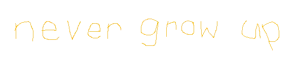

   
  

  

<!-- Proudly created with GPRM ( https://gprm.itsvg.in ) -->

<!--  -->
<!--  -->

[**Hi, my name is Jan Poláček (neostetic)**](https://github.com/neostetic).

I'm a creative thinker who loves finding the simplest, most efficient ways to get things done. I wear multiple hats: **Graphics Designer**, **Full-stack Developer**, and **Musician**. I enjoy blending creativity with logic, whether it's crafting a stunning visual, building a seamless web experience, or composing music.

Feel free to connect, collaborate, or just say hi—I’m always open to new ideas and interesting projects!

#### What I do
 - Main source of income: Graphic Designer
 - Music producer
 - Owner of [RobuxRoll (RollOrbit)](https://github.com/RobuxRoll)
 - Developer of [Pixelbite CSS](https://github.com/Pixelbite-CSS)
 - Learning [Unity](https://unity.com)
 - Succesfull IT Student of [SPSMB](https://github.com/SPSMB)
 
#### Recent Projects 

 - [📁 MD2F (Markdown2file)](https://MD2F.github.io)
 - 🫟 PyGraphics (WIP, Work-Private)
 - [🚀 EvadeAsteroid (JAVA)](https://github.com/neostetic/EvadeAsteroid)
 - [🖱️ PixelbiteCSS (Frontend CSS and JS framework)](https://Pixelbite-CSS.github.io/)
 - [📎 Custom Programming OS (GUI)](https://neostetic.github.io/custom-programming-os/)
 - [🚀 Java Space Arcade Game](https://github.com/neostetic/java-arcade-game) (revisited in [🚀 EvadeAsteroid (JAVA)](https://github.com/neostetic/EvadeAsteroid))
 - [🚙 Python Untitled Skater Game](https://github.com/neostetic/python-skater-game)
 - [🏫 SPSMB - School Design Test](https://neostetic.github.io/School-Website-Test/)
 - [🚗 Autodeformace](http://autodeformace.cz)
 - [🏎️ OGO Racing](http://ogoracing.clanweb.eu)
 - [📝 Planrr (Notepad App)](https://neostetic.github.io/Planrr/)
 - [💬 Basic Chat Web/App](https://zenith-airy-cabinet.glitch.me) (outdated)
 - [🌐 Linux Shells Website [CZ]](https://neostetic.github.io/Linux-Shells/)
 - [📣 Translator](https://stripe-thread-feet.glitch.me) (outdated)
 - [🎲 RobuxRoll (RollOrbit)](https://robuxroll.github.io) (outdated)
 - [🌐 Tailwind UI Website [CZ]](https://neostetic.github.io/Tailwind-UI-Website)
 - [🧱 JustBunker](https://github.com/neostetic/project)
 - [🏍️ PBP-Holder](https://pbp-holder.cz) (outdated)
 - [📝 Machinegunfly](https://machinegunfly.github.io)
 - [🍪 Cookieclicker98](https://cookieclicker98.github.io) (first project)

#### Skills

#### Contact & Socials
 - [📧 Email](mailto:gg.polacek@gmail.com)
 - [🐦 Twitter](https://twitter.com/neostetic)
 - [📷 Instagram](https://www.instagram.com/akloholyk)
 - [🎮 Steam](https://steamcommunity.com/id/pixel08)

  

<!--
  <a href="https://neostetic.github.io">
    

       
       
    

  </a>
  

  <h4 align="center">
    Owner of <a href="https://github.com/RobuxRoll">RobuxRoll (RollOrbit)</a> 
    Developer of <a href="https://neostetic.github.io/Tailwind-UI-Website/">Tailwind UI Website [CZ]</a> 
    Developer of <a href="https://github.com/cookieclicker98">Cookieclicker98</a> 
    <a href="https://neostetic.github.io">CSS Enthusiast</a> 
  </h4>
  

-->
